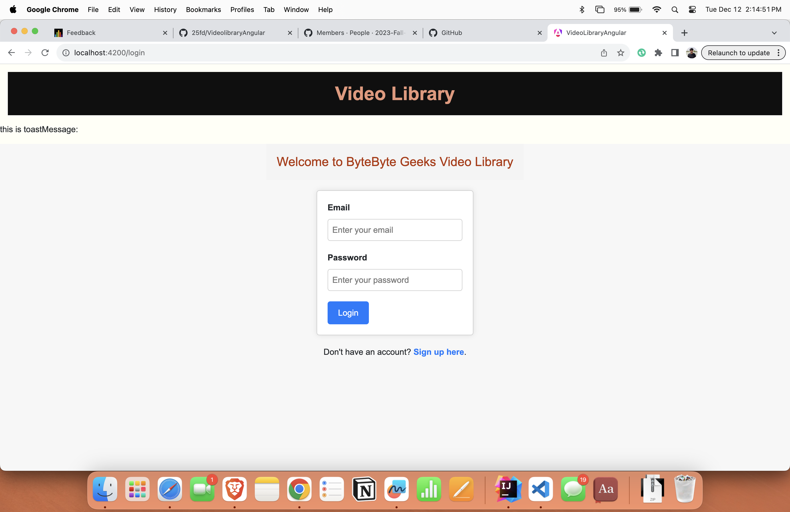
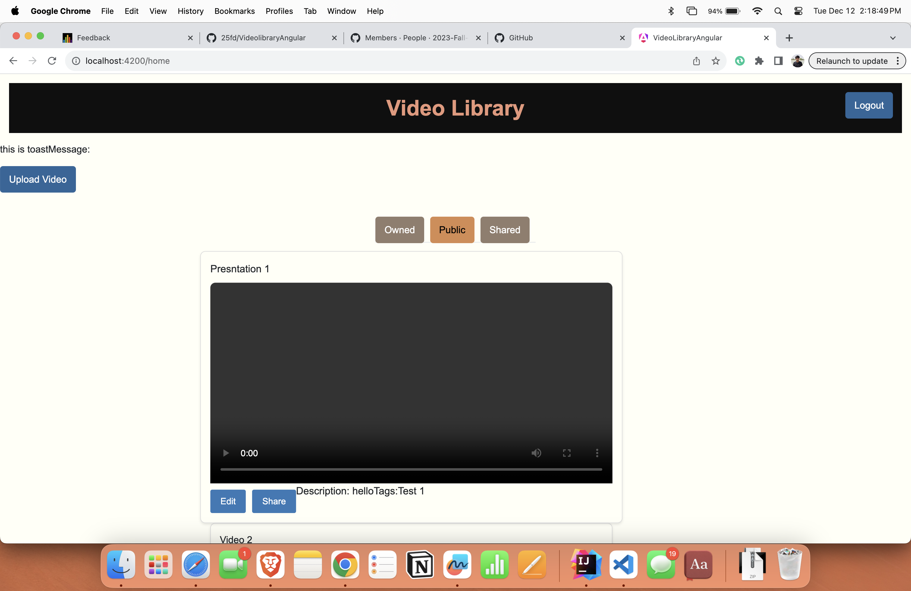
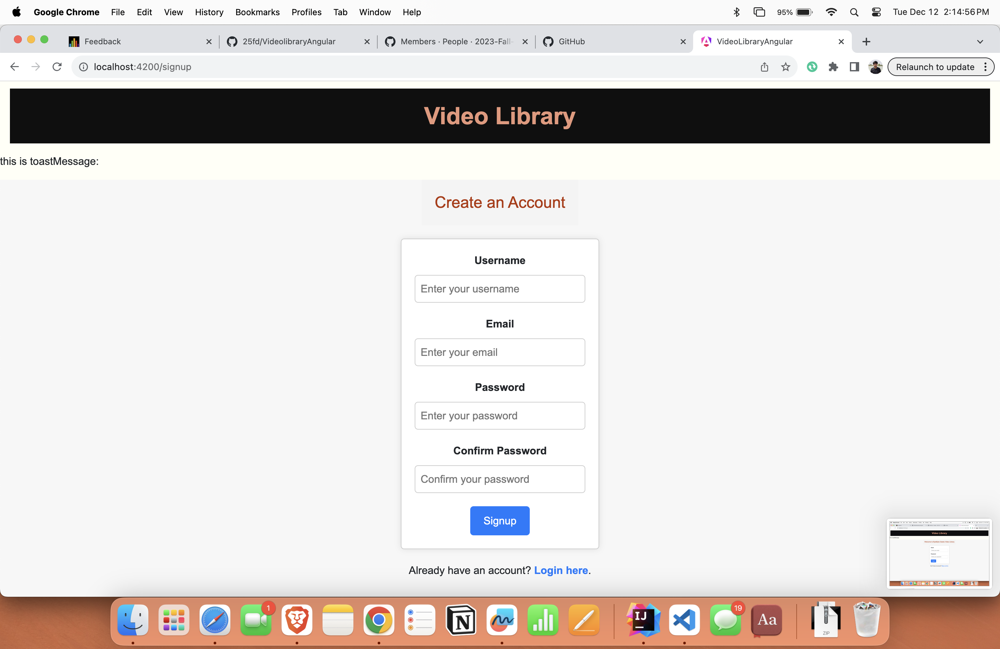
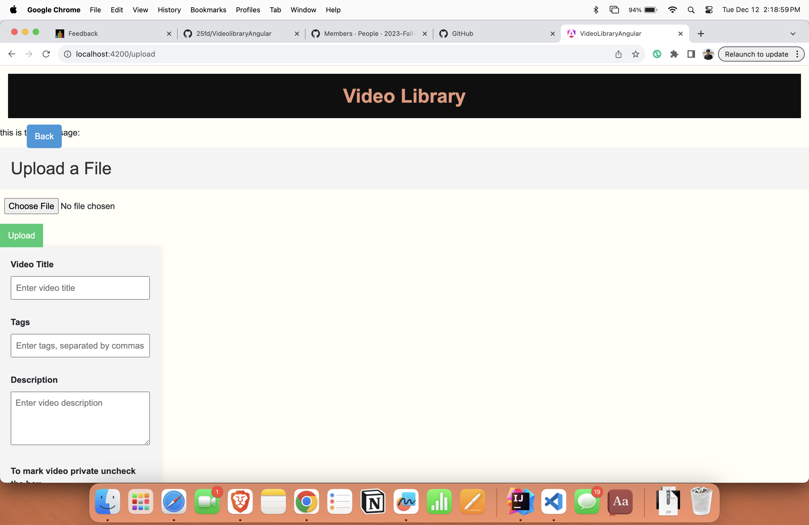
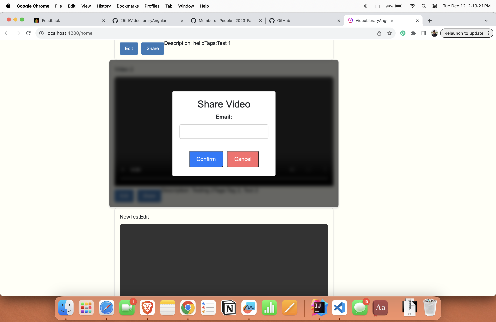
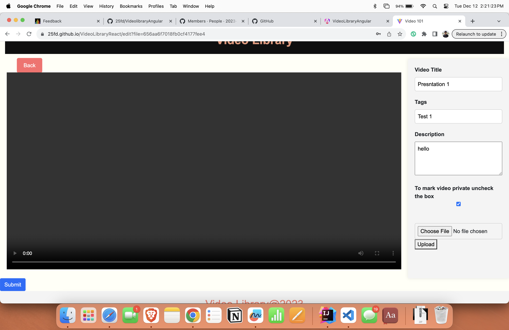

## Video Library System

The project scope is aimed to develop a user friendly web application that allows users to upload videos, edit metadata, assign tags, manage privacy, set thumbnails and to view the video.

## Overview
1. **Features**
- Upload a video with Title and Description.
- Assign tags to the videos.
- Set video Thumbnail.
- Video Privacy management.
- Video share.
- Edit Metadata

2. **Functional Requirements**
- Users can upload videos with Title description and tags along with providing access to other users to view.
- Users can upload and set video thumbnails.
- Users can also edit metadata for all the videos owned by the same users.

3. **Non-Functional Requirements**
- User friendly.
- Efficient and easy to use.

## Team Members

1. **Jay Savani**
   - **Contributions:**
     - Login functionality
     - Signup functionality

2. **Falgun Dudhat**
   - **Contributions:**
     - Video home page design and implementation
     - Upload page design and implementation

3. **Parth Lukhi**
   - **Contributions:**
     - Edit page functionality
     - CSS design for various pages

## Modules and Contributions

### 1. Login and Signup (Jay Savani)
- **Description:**
  - Jay Savani focused on implementing the login and signup functionality, ensuring a secure and seamless user authentication process.

### 2. Video Home Page and Upload Page (Falgun Dudhat)
- **Description:**
  - Falgun Dudhat took the lead in designing and implementing the video home page, creating an engaging user interface for users to browse and view videos. 
  - Additionally, Falgun worked on the upload page, allowing users to contribute their own content to the platform.

### 3. Edit Page and CSS Design (Parth Lukhi)
- **Description:**
  - Parth Lukhi's primary focus was on the edit page functionality, allowing users to modify their content as needed. 
  - Additionally, Parth was responsible for the overall CSS design of various pages, ensuring a visually appealing and cohesive user experience.

## Getting Started

To run the project locally, follow these steps:

1. **Clone the Repository:**
   - git clone https://github.com/25fd/VideolibraryAngular
   - React application https://25fd.github.io/VideoLibraryReact/home

2. **Install Dependencies**
   - npm install

3. **Run the Application**
   - npm start
   - ng serve

## Screenshots

